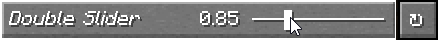

<script setup>
import ViewGithub from '../../components/ViewGithub.vue'
</script>

# The @DoubleSlider Annotation

<ViewGithub url="https://github.com/isXander/YetAnotherConfigLib/blob/1.20.x/dev/common/src/main/java/dev/isxander/yacl3/config/v2/api/autogen/DoubleSlider.java" />



The `@DoubleSlider` annotation creates an option with a `DoubleSliderControllerBuilder` controller.

## Usage

```java
@AutoGen(...)
@DoubleSlider(min = 0, max = 1, format = "%.2f")
public double myDoubleOption = 0.5;
```

## `min`

The `min` property is used to set the minimum value of the slider. If a user enters a value less than this, it will be clamped to this value.

If this is set to `-Double.MAX_VALUE`, there will be no minimum.

If the current value is at this minimum, if available, the translation key `yacl3.config.$configId.$fieldName.fmt.min` will be used.

The default value is `-Double.MAX_VALUE`.

## `max`

The `max` property is used to set the maximum value of the slider. If a user enters a value more than this, it will be clamped to this value.

If this is set to `Double.MAX_VALUE`, there will be no maximum.

If the current value is at this maximum, if available, the translation key `yacl3.config.$configId.$fieldName.fmt.max` will be used.

The default value is `Double.MAX_VALUE`.

## `step`

The `step` property is used to set the step size of the slider. For example, if this is set to 0.1, the slider will increment/decrement by 0.1 when dragging, no less, no more and will always be a multiple of 0.1.

The default value is 0.01.

## `format`

The `format` property is used to set the format used to display the double. This is the syntax used in `String#format(String, Object...)`.

The default value is `%.2f`, meaning that the double will be displayed with 2 decimal places.

