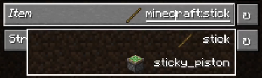

<script setup>
import ViewGithub from '../../components/ViewGithub.vue'
</script>

# The @ItemField Annotation

<ViewGithub url="https://github.com/isXander/YetAnotherConfigLib/blob/1.20.x/dev/common/src/main/java/dev/isxander/yacl3/config/v2/api/autogen/ItemField.java" />



The `@ItemField` annotation creates an option with a `ItemControllerBuilder` controller.

## Usage

```java
@AutoGen(...)
@ItemField
public Item itemField = Items.AZURE_BLUET;
```

As long as the item is registered in `Registries.ITEM`, it can be displayed in the item field.