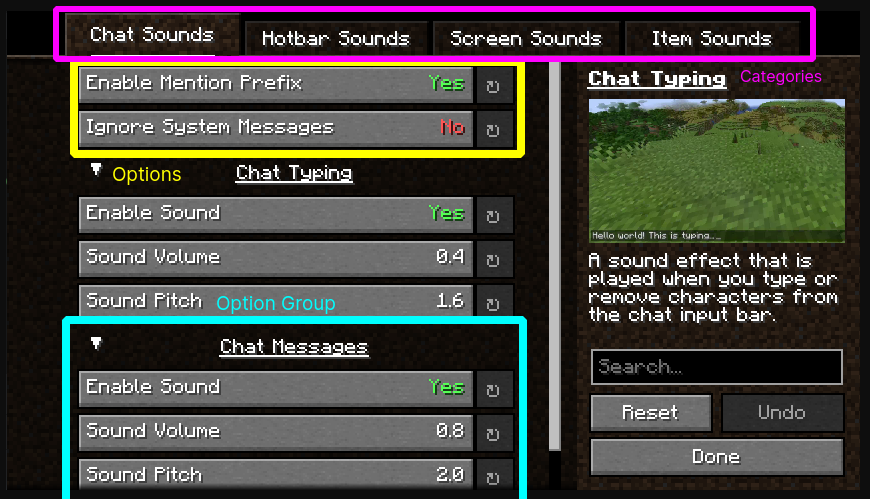

# Generating a Config Screen

There are two ways to generate a config screen using YACL, you can either use the automatic generator via annotations or manually generate the screen using a builder.

YACL screens consist of categories, which consist of options and option groups.

- Options are the actual configuration fields, they can be edited by the user.
- OptionGroups are collapsable groups of options, they can be used to organize your options.
- Categories are the top-level groups of options and option groups, they can be used to further categorize your options, in 1.19.4+ versions of YACL, categories use the new UI tab system.

There are benefits and drawbacks to both methods, so it's up to you to decide which one you want to use.

## Automatic Generation

::: info
Automatic generation is **recommended for simple mods** that don't need a lot of customization.
:::

Automatic generation is the easiest way to generate a config screen, however it's also the most limited.

Automatic generation uses annotations to generate the screen, this means that you can't customize the screen as much as you can with manual generation.

## Manual Generation

::: info
Manual generation is **recommeneded for larger mods** that require in-depth customization functionality.
:::

Manual generation is the most customizable way to generate a config screen, however it's also the most complicated.

Manual generation uses builders to generate the screen, this means that you can customize the screen as much as you want and interlink options and optiongroups together (eg. Setting an option's value to `false` disables other options from being edited.)

## Get Started

To get started, you should go to the corresponding pages, depending on which method you want to use.

- [Automatic Generation](./autogen/setup)
- ~~Manual Generation~~ - Coming Soon...